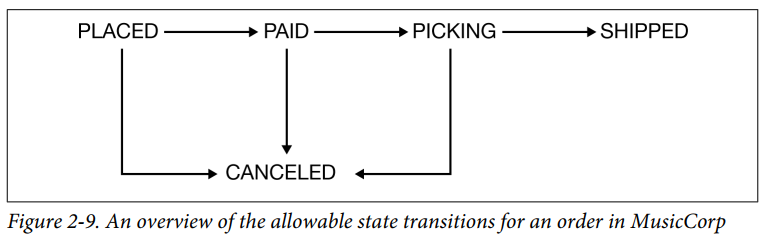

# Preface

## Microservices

- An approach to **distributed systems** that promote the use of finely grained services **that can be changed, deployed, and released INDEPENDENTLY**.
  - **Note:** As a distributed system, they bring a host of **complexity**.
- Provide us with a huge number of **options** for building out systems, giving us a lot of **flexibility**.
- **Trade off** between flexibility and complexity.

## Why Sam Newman Wrote This Book

- Microservices have become, for many, the **default architectural choice**. This is something that is **hard to justify**.

## Navigating This Book

- The **main body** of the book is broken into three separate parts:
  1. Foundation
  2. Implementation
     - Chapter 5 - Technologies used to implement **inter-microservice communication**.
     - Chapter 6 - Comparison of **sagas** and **distributed transactions** and discusses their usefulness in **modeling business processes** involving **multiple** microservices.
     - Chapter 9 - Challenges of testing microservices, including the issues caused by **end-to-end tests**.
     - Chapter 11 - Microservice architectures can **increase the surface area of attack** but also give us more opportunity to **defend in depth**.
     - Chapter 13 - **Four aspects of scaling** and show how they can be used in combination.
  3. People

# Part I. Foundation

# Chapter 1. What Are Microservices?

## Microservices at a Glance

- Modeled around **business domain**.
- **A type of service-oriented architecture (SOA)**, albeit one that is **opinionated about how service boundaries should be drawn**, and one in which **independent deployability** is key.
- Hosts business functionality on one or more **network endpoints**.
- Microservice architectures **AVOID** the use of **shared databases**.
- A microservice exposing its functionality over a **REST API** and a **topic**:
  
- Microservices embrace the concept of **information hiding** (similar to the **encapsulation** in OOP), meaning hiding as much information as possible inside a component.
  - **Hexagonal Architecture** pattern - The importance of keeping the internal implementation separate from its external interfaces, with the idea that you might want to interact with the same functionality over different types of interfaces.
- \*Having a **stable service boundaries** that don't change when the internal implementation changes results in systems that have **looser coupling** and **stronger cohesion**.

### Are SOA and Microservices Different Things?

#### SOA

- **Multiple services collaborate** to provide **a certain end set** of capabilities.
- **Lack of good consensus** on how to do SOA well.
- **Problems** of SOA are:
  - Vendor middleware
  - A lack of guidance about service granularity
  - Wrong guidance on picking places to split your system (Unstable service boundaries)
- Oftentimes, services are **coupled to a database** and had to **deploy everything together**. So, it's **not microservices**.

#### Microservices

- Think of it as being a **specific approach for SOA**.

## Key Concepts of Microservices

### \*Independent Deployability

- Can make a change to a microservice, deploy it, and release that change to our users, without having to deploy any other microservices.
- **Simple idea** that is nonetheless **complex in execution**. (Simple is not easy)
- **\*Key takeaway:** Embrace the concept of independent deployability.
- To achieve:
  - Need to make sure our microservices are **loosely coupled**.
  - Need explicit, well-defined, and **stable contracts** between services.
  - **Note:** There are so many other things you have to get right that in turn have their own benefits.

### Modeled Around a Business Domain

- **Domain-driven design (DDD)** is a technique to define **service boundaries**.
- When **service boundaries** are **not well-defined**...

  - **Rolling out a feature** that requires changes to **more than one microservice** is **expensive**. You need to coordinate the work across each service (and potentially across separate teams) and carefully **manage the order** in which the new versions of these services are deployed.
  - **Layered architecture** - Each service boundary based on related **technical functionality**.

    - Figure 1-3. Making a change across all three tiers is more involved

    

- With microservices, we **prioritize high cohesion of business functionality** over high cohesion of technical functionality.

### Owning Their Own State

- To make independent deployability a reality, we need to ensure that we **limit backward-incompatible changes** to our microservices.
- **Important:** **Sharing databases** is one of the **WORST** things you can do if you're trying to achieve independent deployability.
- **Objective:** To reduce the effort needed to change business-related functionality.

### Size

- Chris Richardson opinion - The goal of microservices is to have "as small an interface as possible."
- But, the concept of size is **highly contextual**.
- Not to worry about size. Rather **focus on**:
  1. How many microservices can you handle? As you have more services, the complexity of your system will increase.
     - Adopt **incremental migration** to microservice architecture.
  2. How do you define **service boundaries** (**loose coupling**, **high cohesion**)?

### Flexibility

- Have a **cost**.
- **Four aspects** of flexibility:
  1. Organizational
  2. Technical
  3. Scale
  4. Robustness
- Think of adopting microservices as less like flipping a switch, and more like turning a dial.

### Alignment of Architecture and Organization

- **Conway's law** - Organizations which design systems are constrained to produce designs which are copies of the communication structures of these organizations.
- Group people in **poly-skilled teams** to reduce handoffs and silos.
- **Three tiers** - An architecture that has **high cohesion of related technology** but **low cohesion of business functionality**.
- To make it easier to make changes, instead we **need to change how we group code, choosing cohesion of business functionality** rather than technology.
- A **dedicated team** that has **full-end-to-end responsibilities** for making changes.

  - Figure 1-4. The UI is broken apart and is owned by a team that also manages the server side functionality that supports the UI

    

## The Monolith

- To understand whether **microservices** are **worth considering**.
- Referring to **a unit of deployment**. When all functionality in a system must be deployed together.
- Variations of monolith:
  - Single-process monolith
  - Modular monolith
  - Distributed monolith

### The Single-Process Monolith

- You may have two or more monoliths that are tightly coupled to one another, potentially with some vendor software in the mix.
- Even as the organization grows, the monolith **can potentially grow with it** (modular monolith).

### The Modular Monolith (A Middle Ground)

- A **subset** of the single-process monolith.
- Single process consists of **separate modules**.
- If the **module boundaries** are well defined, it can allow for a high degree of **parallel work**, while **avoiding the challenges** of the more **distributed microservice** architecture by having a much **simpler deployment topology**.
- **Challenge** - **Database** tends to **lack the decomposition** we find in the code-level, leading to **significant challenges** if you want to **pull apart** the monolith in the future.

  - **Solution** - Having the database decomposed along the same lines as the modules.
  - Figure 1-8. A modular monolith with a decomposed database:

    

### The Distributed Monolith

- **Analogy** - The failure of a computer you **didn't even know existed** (e.g. other microservices) can render your own computer unusable.
- Has **all the disadvantages** of a distributed system, and the disadvantages of a single-process monolith, without having enough of the upsides of either.
- Not enough focus was placed on concepts like **information hiding** and **cohesion of business functionality**.
- Cause changes **to ripple across** service boundaries.

### Monolith and Delivery Contention

- When **more people** are working on the same codebase, we face challenges of **confused line of ownership**.
- **Microservice architecture** does give you more **concrete boundaries** around which ownership lines can be drawn in a system.

### Advantages of Single-Process or Modular Monolith

- Simpler/Simplify...
  - Deployment topology
  - Developer workflows
  - Monitoring
  - Troubleshooting
  - End-to-end testing
  - Code reuse
- To **reuse code** within a **distributed system**, we need to decide whether we want to:
  1. Copy code
  2. Break out libraries
  3. Push the **shared** functionality into a **service**
- Monolith is the sensible default choice as an architectural style.

## Enabling Technology

- **Understanding the tools** that are available to help you get the most out of this architecture is going to be a **key part** of making any implementation of microservices a success.

### \*Log Aggregation and Distributed Tracing

- Treat **log aggregation** system as a **PREREQUISITE** for adopting a microservice architecture.
- To make these log aggregation tools even more useful by implementing **correlation IDs**, in which a single ID is used **for a related set of service calls**.
- As your system **grows in complexity**, it becomes **essential to consider tools** that allow you to better explore what your system is doing, providing the ability to **analyze traces** across multiple services, detect bottlenecks, and ask questions of your system.

| Tool                                | Product                                                                                                                                                                                                                                                                                                                                   |
| ----------------------------------- | ----------------------------------------------------------------------------------------------------------------------------------------------------------------------------------------------------------------------------------------------------------------------------------------------------------------------------------------- |
| \*Log aggregation                   | - **Simple logging services** provided by **public cloud vendors**, such as [Azure Monitor](https://learn.microsoft.com/en-us/azure/azure-monitor/fundamentals/overview) (might be good enough to get started). - [Falcon LogScale](https://www.crowdstrike.com/platform/next-gen-siem/falcon-logscale/) (formerly known as _Humio_) |
| Distributed tracing (OpenTelemetry) | - [Jaeger](https://www.jaegertracing.io/) - [Lightstep](https://docs.lightstep.com/), [Honeycomb](https://www.honeycomb.io/) (**new generation** of tools)                                                                                                                                                                           |

### Containers and Kubernetes

- Normal virtualization techniques (VM) can be quite **heavy**.
- **Containers** are...
  - Lightweight
  - Faster spin-up times
  - Cost effective
- If you do end up adopting Kubernetes, ensure that **someone else** is running the Kubernetes cluster for you.
- Running your own Kubernetes cluster can be a **significant amount of work**!

### Streaming

| Tool              | Product                                                                                                                                                                                      |
| ----------------- | -------------------------------------------------------------------------------------------------------------------------------------------------------------------------------------------- |
| Data streaming    | - [Apache Kafka](https://kafka.apache.org/) (**the de facto choice** for streaming data) - [Debezium](https://debezium.io/) (help stream data from **existing datasources** over Kafka) |
| Stream-processing | - [Apache Flink](https://flink.apache.org/)                                                                                                                                                  |

### Public Cloud and Serverless

- As your microservice architecture grows, **more work** will be pushed into the **operational space**.
- **Serverless** - Hide the underlying machines, allowing you **to work at a higher level of abstraction**.
- Examples of **serverless products**:
  - Message brokers
  - Storage solutions
  - Databases
  - Function as a Service (FaaS) - Provide a **nice abstraction** around the **deployment of code**.

## Advantages of Microservices

### Technology Heterogeneity

- Can decide to **use different technologies** inside each one.
- Able to more quickly adopt technologies.

### Robustness

- As long as a **failure doesn't cascade**, you can isolate the problem.
- To make microservices more robust, we need to understand the **new sources of failure** that distributed systems have to deal with (e.g. **network failure**).

### Scaling

- By splitting out **core parts** of a monolith system, we can solve its scaling problem.
- By using a public cloud provider, we can even scale **on demand**.

### Ease of Deployment (For New Changes)

- Allows us to get our code deployed more quickly.
- Making fast rollback easy to achieve.

### Organization Alignment

- Smaller teams working on smaller codebases tend to be more productive.

### Composability

- Open up opportunities for **reuse** of functionality.
- Allow for our functionality to be consumed in different ways for different purposes.
- **Microservices** - **Opening up seams** in our system that are addressable by outside parties.
- **Monolith** - Often have **one coarse-grained seam** that can be used from the outside.

## Microservice Pain Points

### Developer Experience

- More **resource-intensive runtimes** like the JVM can limit the number of microservices that can be run on a single developer machine.
- Developing in the cloud - **Feedback cycles** can suffer greatly.

### Technology Overload

- Need to spend a lot of time understanding issues around...
  - Data consistency
  - Latency
  - Service modeling

### Reporting

- Figure 1-12. reporting carried out directly on the database of a **monolith**

  

- More modern approaches to reporting, such as using **streaming** to allow for real-time reporting on large volumes of data.
- Publish data from your microservices into central reporting databases.

### Monitoring and Troubleshooting

- **Monolith** - Failure mode is somewhat **binary**.

### Security

- More vulnerable to being observed **in transit**.

### Testing

- Scope of end-to-end tests becomes **very large**.
- Need to be prepared for the **false negatives** that occur when environmental issues, such as **service instances dying** or **network timeouts of failed deployments**, cause tests to fail.
- New forms of testing:
  - Contract-driven testing
  - Testing in production
- Progressive delivery techniques:
  - Parallel runs
  - Canary releases

### Latency

- Needs to be serialized, transmitted, and deserialized over networks.
- Can be difficult to measure the exact impact on latency of operations at the **design** or **coding phase**.
- To **measure** the end-to-end latency, you can use **distributed tracing** tools.

### Data Consistency

- The use of distributed transactions proves to be **highly problematic** in coordinating state changes.
- Using concepts like **sagas** and **eventual consistency**.

## Should I Use Microservices?

- Need to assess your own **problem space**, skills, and technology landscape and understand **what you are trying to achieve**.

### Whom They Might Not Work For

- **Brand-new products:**
  - **Reason** - The domain that you are working with is typically undergoing **significant change** as you **iterate on the fundamentals**, result in more changes being made to **service boundaries**.
  - Should **wait until** enough of the **domain model has stabilized** before looking to define service boundaries.
- **Startup:**
  - **Reason** - Smaller team has **limited resources** to handle the complexity of the microservice architecture, such as deployment and service management ("microservice tax").
  - It's much easier to move to microservices **later**, after you **understand where the constraints are** in your architecture and what **pain points** are.
- Software that will be deployed and managed by their **customers**.

### Where They Work Well

- To allow for **more developers** to work on the same system.
  - The single biggest reason.
  - To reduce **delivery contention**.
- **Software as a Service (SaaS)** applications
  - Expected to operate 24-7, which creates **challenges** when it comes to **rolling out changes**.
- Applications that leverage various technologies
  - **Technology-agnostic** nature of microservices ensures that you can get the most out of **cloud platforms**.
  - **Note:** **FaaS** platform is not a deployment mechanism that would be suitable in all cases.

## Summary

- Why many people are choosing microservice architectures:
  - Flexibility in choosing technology, handling robustness and scaling, organizing teams.
- Still, the choice must be justified by the problems you are trying to solve.

# Chapter 2. How to Model Microservices

- **Decomposition** comes in different forms.
- Primary technique - Domain-Driven Design.

## What Makes a Good Microservice Boundary

- In essence, microservices are **just another form of MODULAR decomposition**.
- **Three key concepts/techniques** to working out what makes for a good microservice boundary:
  1. Information hiding
  2. Cohesion
  3. Coupling

### \*Information Hiding

- The **most effective** way to define module boundaries.
- Benefits of modules:
  - Improved development time
  - Comprehensibility
    - Can be **looked at** in **isolation** and **understood** in isolation.
  - Flexibility
    - Can be changed independently.
- Microservices is just another form of modular architecture.
- **BUT**, having modules **doesn't result in** you actually achieving these outcomes.
- By keeping the number of interfaces **small**, it is easier to ensure that we can change one module without impacting others.

### Cohesion

- \***The code that changes together, stays together.**
- Ease of making changes in business functionality.
  - Functionality grouped in such a way that we **can make changes in as few places as possible**.
- Making changes in lots of **different places** is **slower**, and deploying lots of services at once is **risky**.

### Coupling

- **Loosely coupled** - A change to one service should not require a change to another.
- A loosely coupled service **knows as little as it needs to** about the services with which it collaborates.
- **Chatty communication** can lead to tight coupling.

### The Interplay of Coupling and Cohesion

- \*A structure is **stable** if **cohesion is STRONG** and **coupling is LOW**.
- **Cohesion** - The relationship between things inside a boundary (a microservice).
- **Coupling** - The relationship between things across.
- **Note:** The world isn't static - Sometimes parts of your system may be going through so much change that stability might be impossible.

## Types of Coupling

- **NOT** all coupling is bad.
- In fact, some coupling will be **unavoidable**.
- **What we want** - **Reduce** how much coupling we have.
- Microservices are a style of **modular** architecture.
  - Can use a lot of these original **concepts**.
- Figure 2-1. **The different types of coupling**, from loose (low) to tight (high)

  

### Domain Coupling

- One microservice needs to interact with another microservice.
- Figure 2-2. An example of domain coupling, where Order Processor needs to make use of the functionality provided by other microservices

  

- This type of interaction is largely **unavoidable**.
- **BUT**, we still want to keep this to a **minimum**.
- \*When a **single** microservice depending on **multiple downstream** services, it **might imply** a microservice that is **doing too much** (too much logic has been **centralized**).
- Domain coupling can become problematic as more **complex sets of data** are sent between services.
- **Note:** Share only what you absolutely have to, and send only the absolute **minimum amount of data**.

### Pass-Through Coupling

- One microservice passes data to another microservice purely because the data is **needed by** some other microservice **further downstream**.
- \*One of the **most problematic** forms of **implementation coupling**.

  - Figure 2-4. **Pass-through coupling**, in which data is passed to a microservice purely because another downstream service needs it

    - ❌ Changes to _Shipping Manifest_ require a **lockstep rollout** of all three microservices (cascade effect).

    

- **First solution** - Bypass the intermediary.

  - Figure 2-5. One way to work around pass-through coupling involves communicating directly with the downstream service

    

  - _Order Processor_ speaks directly to _Shipping_.
  - **Tradeoff**
    - Increase domain coupling.
    - Might still be fine, as domain coupling is a **looser form** of coupling.

- **Second solution** - Hide the requirement for a _Shipping Manifest_.

  - Figure 2-6. Hiding the need for a _Shipping Manifest_ from the Order Processor

    

### Common Coupling

- Two or more microservices make use of a **common set of data**.
  - Shared database, memory or filesystem.
- Changes to the structure of the data can impact multiple microservices at once.
- Still acceptable, but **not recommended**:

  - Figure 2-7. Multiple services accessing shared static reference data related to countries from the same database

    

  - Since **static reference data** doesn't tend to change and is **read-only**, this is still fine.

- Becomes more problematic:

  - If the **structure** of the common data changes more frequently.
  - If multiple microservices are reading and **writing to the same data**.

- **Problem:**

  - Figure 2-8. An example of common coupling in which both Order Processor and Warehouse are updating the same order record

    

  - Both microservices **share responsibilities** for managing **different aspects of the life cycle** of an order.
  - One way to ensure that the state is changed in a correct order would be to create a **finite state machine**, ensuring **invalid state transitions are prohibited**.
  - Figure 2-9. An overview of the allowable state transitions for an order in MusicCorp

    

- **Solution** - Ensure that a **single microservice** manages the order state.

  - Figure 2-10. Both Order Processor and Warehouse can request that changes be made to an order, but the **Order microservice decides which requests are acceptable**

    

- **Alternative:**
  - Implement the Order service **more than a wrapper** around database CRUD operations.
  - CRUD wrapper is **a sign of weak cohesion and tighter coupling**, as logic that should be in that service is instead **spread elsewhere**.
- Potential sources of resource contention (overload shared resource).
- Common coupling is **sometimes** OK, but **often it's not**.
- Often indicate a lack of cohesion.
- One of the **least desirable** forms of coupling.

### Content Coupling (Worst)

- An upstream service **reaches into the internals** of a downstream service and **changes its internal state**.
- E.g. An external service accessing another microservice's database and changing it directly.
- The lines of **ownership become less clear**, and it becomes more difficult for developers to change a system.
- Results in very **poor data integrity**.
- Figure 2-11. An example of content coupling in which the Warehouse is directly accessing the internal data of the Order service

  

- Also have the issue that the **internal data structure is exposed**.

## Just Enough Domain-Driven Design

- Some core concepts of DDD:
  - Ubiquitous language
  - Aggregate
  - Bounded context

### Ubiquitous Language

- Common problem - When rich domain language is map to generic code concepts (too abstract).

### Aggregate

- Typically have a **life cycle**, and can be implemented as a **state machine**.
- Ensure that the code that handles the **state transitions** of an aggregate are **grouped together**, along with the **state itself** (saga state).
- \*If an outside party requests a **state transition** in an aggregate, the aggregate can say no to **protect business invariants**.
- Assuming **Finance microservice**'s database stores the **vanilla customer ID** into the `CustID` column.

  - **Problem** - Relationship between the `CustID` column and the remote customer is **entirely implicit**.
  - **Solution 1** - Store a **URI** to make the relationship explicit.
  - Figure 2-13. An example of how a relationship between two aggregates in different microservices can be implemented

    

  - **Solution 2** - Pseudo-URI scheme (if you aren't building a REST system)
    - E.g. soundcloud:tracks:123

- Factors that determines how we define aggregates, to **reshape aggregates** over time:
  - For performance reasons.
  - For ease of implementation.

### Bounded Context

- E.g. At MusicCorp:
  - **Core domain** - Warehouse
  - **Supporting domain** - Finance
- Bounded contexts hide implementation detail.
- Internal concerns should be hidden from the outside word.

#### Hidden models

- Figure 2-14. A shared model between the finance department and the warehouse

  - To work out the valuation of the company, finance employees need information about the stock.
  - May be beneficial to name the internal and external models differently to avoid confusion.

  

- Figure 2-15. A model that is shared can decide to hide information that should not be shared externally

  

#### Shared models

- E.g. **Customer** can have **different meanings** in the **different bounded contexts**.
  - Finance - "Customer"
  - Warehouse - "Recipient"
- May need to link both **local concepts** to a **global customer**, to look up common, shared information.

  - Figure 2-13. An example of how a relationship between two aggregates in different microservices can be implemented

    

### Mapping Aggregates and Bounded Contexts to Microservices

- Aggregate is a self-contained **state machine** that **focuses on a single domain concept**.
- \***Service boundaries:**
  - **Coarse-grained** - One microservice **per bounded context**. **(Preferred)**
  - **Fine-grained** - One microservice **per aggregate**.
- \***Note:** One microservice can manage one or more aggregates, but we don't want one aggregate to be managed by more than one microservice.

#### \*Turtles all the way down

- At the start, you identify some coarse-grained bounded contexts. **BUT**, these bounded contexts **can contain further bounded contexts**.
- By implementing one microservice per coarse-grained context, we can hide future service decomposition decisions.
- Decision to decompose a service into smaller parts is arguably an **implementation decision**.
- Figure 2-16. The Warehouse service internally has been split into Inventory and Shipping microservices

  - Another form of **information hiding**.
  - **Nested approach** - Chunk up the architecture to **simplify testing**.

  

### Event Storming

- A collaborative brain-storming exercise designed to help **surface a domain model**.
- Brings together **technical** and **nontechnical** stakeholders.
- Can be used to build:
  - Event-driven system
  - Request/response-oriented system

#### Logistics (How event storming should be run)

- You want **representatives** of all parts of the domain that you plan to model: **users**, **subject matter experts**, **product owners**.
- Walls to be used for capturing information.

#### The process

- Identify the **DOMAIN EVENTS**.
  - Things that happen (facts that you care about).
  - E.g. "Order Placed".
- Identify the **COMMANDS** that cause these events to happen.
  - Identity the key **human actors**.
- \***Note:** Not to let any current implementation warp the perception of what the domain is.
- With events and commands captured, **AGGREGATES** come next.
  - **Events** can also highlight what the potential aggregates might be.
  - E.g. **"Order Placed"**
    - **"Order"** (noun) could be a potential **aggregate**.
    - **"Placed"** describes something that can happen, so this could be part of the **life cycle** of the aggregate.
  - Commands and events are clustered around the aggregate.
  - Events from one aggregate might trigger behavior in another.
- Group aggregates into **BOUNDED CONTEXTS**.
  - Bounded contexts most commonly follow a company's **organizational structure**.

## Alternatives to Business Domain Boundaries

- DDD is **NOT the only technique** for finding microservice boundaries.

### Volatility

- Identify the parts of your system going through **more frequent change** and then extract that functionality into their own services.
- If your intention is to **SCALE** your application, then **volatility-based decomposition is NOT the right technique**.
- **Bimodal IT** (Mindset Behind):
  - Break systems down into two categories, based on **how fast or slow** they need to go.
    1. "Mode 1" (aka Systems of Record)
    2. "Mode 2" (aka Systems of Innovation)
  - **Cons:**
    - Imply a very **fixed view** (oversimplification).
    - Fall apart when parts of systems that didn't need to change much in the past suddenly do.
    - Often becomes a way for people to dump stuff that is hard to change into a nice neat box.
    - Avoids the fact that quite often changes in functionality require changes in "Systems of Record" (Mode 1) to allow for changes in "Systems of Innovation" (Mode 2).
  - **Pros:**
    - Useful if the **main driver** is about **fast time to market**.

### Data

- **Use case** - To limit which services handle **personally identifiable information (PII)**.
- E.g. A payment company handles **credit card data**, and needs to comply with **Payment Card Industry (PCI) standards** (company's system and processes needed to be **audited**).
- So, we limit what has to be in this red zone.
- Segregation of data is often driven by a variety of **privacy** and **security concerns**.
- Figure 2-17. PaymentCo, which segregates processes based on its use of credit card information to limit the scope of PCI requirements

  

### Technology

- Often a **less than ideal** architecture.

### Organizational

- **Conway's law** - How you organize yourself ends up driving your systems architecture.
- Figure 2-19. A service boundary split across technical seams

  

## Mixing Models and Exceptions

- Follow the guidelines of **information hiding**, **coupling** and **cohesion**.
- Organizational and **domain-driven** service boundaries are great **starting point**.

## Summary

- **Understanding of our domain** can be vital tool in helping us find these **seams**.
